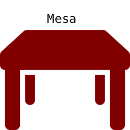

# Mesa

Mesa is a object relational mapping tool that allows users to translate
data from SQLite3 tables ('mesa') to Ruby objects that can be manipulated
by a web framework. In order to use `Mesa` methods on a model, its class
must inherit from `Mesa`.

For example:

```ruby
require 'mesa'

class Human < Mesa
  has_many :cats
  has_many :humans
  belongs_to :home,
    class_name: 'House',
    foreign_key: :house_id,
    primary_key: :id
end

class House < Mesa
  has_many :cats
end

class Cat < Mesa
  belongs_to :owner,
    class_name: 'Human',
    foreign_key: :owner_id,
    primary_key: :id

  has_one_through :home, :owner, :home
end
```

## Core Features

### CRUD
* `create` - allows the user to add a new row to a table
```ruby
MyClass.new(name: 'generic_user').create
```
* `all`, `where` - read-only methods that allow the user to retrieve
an existing row from a table
```ruby
MyClass.all
MyClass.where(name: 'generic_user')
```
* `update` - allows the user to update an existing row in a table
```ruby
MyClass.update(name: 'another_generic_user')
```
* `destroy` - allows the user to remove an existing row in a table
```ruby
MyClass.where(name: 'another_generic_user').destroy
```

### Associations
* `belongs_to` - defines getter/setter methods that make queries that
satisfy the `:class_name`, `:foreign_key`, and `:primary_key` options
* `has_many` - defines getter/setter methods that make queries that
satisfy the `:class_name`, `:foreign_key`, and `:primary_key` options
* `has_one_through` - defines a getter/setter methods that make queries that
satisfy the `:through_name` and `:source_name` arguments.

## How to Run

An example that demonstrates the functionality of `Mesa` is in the
[test](./test/) folder. Running `ruby cat.rb` in a terminal will
invoke several actions on the `Cat`, `Human`, and `House` models,
which all inherit from `Mesa`. `Mesa` will make the SQLite3 queries
needed to complete each action.

## Technologies

`Mesa` is written using only Ruby. The `sqlite3 gem` was used to
establish a connection between the SQLite3 database and the library.

## Technical Implementation

`Mesa` extensively uses metaprogramming to accomplish the queries it
needs to make to return the desired output. Examples are `belongs_to_options`
and the `belongs_to_options` found [here](./lib/options).

A small consideration was made to improve the readability of the code.
A [helper file](./lib/options/active_support_helpers) was used to monkey
patch methods on Ruby's `String` class:
* `to_camelcase` - ExampleText
* `to_snakecase` - example_text
* `to_singular` - example_text
* `to_plural` - example_texts

## Future Releases

* Support for PostgresQL
* sanitized input throughout
* Support for Rails
